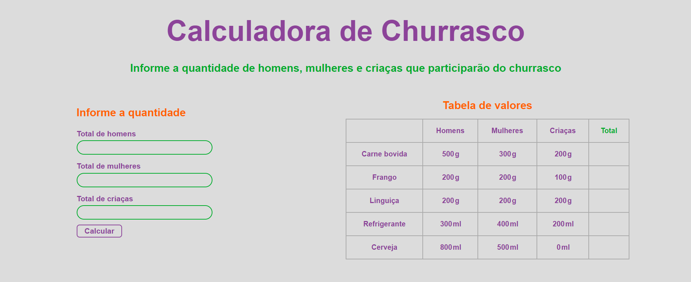

# Calculadora de Churrasco 🍖

#### Esse projeto foi feito pensando em calcular quanto, aproximadamente, de determinadas comidas e bebidas seriam necessário para realizar um churrasco.

### O que foi pedido

_A atividade se baseava em criar uma calculadora que, a partir da quantidade de crianças, homens e mulheres, devolvesse a quantidade de comida e bebeida necessária para um bom churrasco._

_No exemplo que foi disponibilizado, havia uma tabela com as especificações de quantidade por pessoa e era retornado uma lista com a quantidade total de comida e bebida já convertida para **Kg** e **L**._

_A respeito da estilização, foi explicito que poderia ser feita usando css e não poderia ser utilizado bootstrap. Acredito que nenhum outro **framework css** era permitido._

_Além disso, foi descrito que não poderia ser utilizado nenhum **framework JS** que não fosse o [Jquery](https://jquery.com/). Como eu não tenho muita prática com ele, decidi simplesmente usar **JS** puro._

### O que foi entregue

_Uma calculadora com todas as especificações descritas anteriormente... E um pouco mais._

_O **A Mais** que foi entregue foi o fato de poder alterar os valores da tabela e o resultado ser exposto na própria tabela ao invés de uma lista, como no exemplo que foi dado._

_OBS.: Você pode alterar os valores da tabela, mas não pode alterar a unidade de medida. Se um valor não numérico for inserido, é devolvido **Inválido** no campo TOTAL._

### Exemplo funcional

<iframe width="560" height="315" src="https://www.youtube.com/embed/UpeY3a5O6wY?si=ThFiH-3SSecStl-4" title="YouTube video player" frameborder="0" allow="accelerometer; autoplay; clipboard-write; encrypted-media; gyroscope; picture-in-picture; web-share" referrerpolicy="strict-origin-when-cross-origin" allowfullscreen></iframe>

### Contato

**[WhtasApp](https://wa.link/r91uae)**

**[GitHub](https://github.com/BunoQueiroz/)**

**[Portfólio](https://www.brunoq.com.br/)**

**[Instagram](https://www.instagram.com/bruno.castro.q/)**

**[LinkedIn](https://www.linkedin.com/in/bruno-de-castro-queiroz-47a911225/)**
